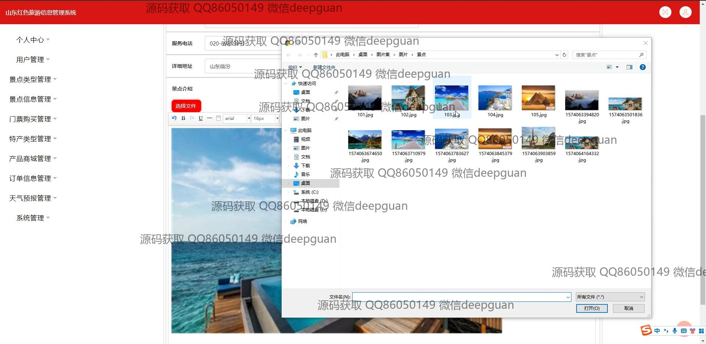

<h1 align="center">基于web的山东红色旅游信息管理系统的设计与实现+jsp</h1>

## 简介
基于Web的山东红色旅游信息管理系统：角色分为管理员、用户；功能包括用户管理、景点信息管理、门票管理、公告管理、天气预报、特产类型管理、订单管理等。    --计算机毕业设计源码；毕设源码；java毕业设计源码

## 联系方式

<h3 align="center">获取完整代码与数据库文件 + 微信：deepguan QQ: 86050149 QQ群: 783742310</h3>

<h3 align="center">可帮忙远程部署 包运行成功！提供远程部署、修改代码、设计文档指导、代码讲解等服务！</h3>

## 功能介绍（完整见运行截图）
管理员：基本功能包括登录、注册和退出系统。可以进行用户管理、景点类型管理、景点信息管理和门票购买管理等功能。支持公告信息编辑、天气预报管理、订单信息管理以及特产类型管理。可在后台修改系统首页图片，并通过不同模块进行数据的增删改查和整体维护。可通过个人中心查看和编辑管理员信息。

用户：可以进行账号登录和注册，支持查看和编辑个人信息。访问景点信息、产品商城和天气预报等功能模块，能够通过搜索和筛选获取景点详细信息及购票。支持公告资讯的浏览和查看天气预报，还可以管理个人订单和收藏信息。通过个人中心进行信息修改并处理账户相关功能。

## 运行截图

本代码来源于网络,仅供学习参考使用!

